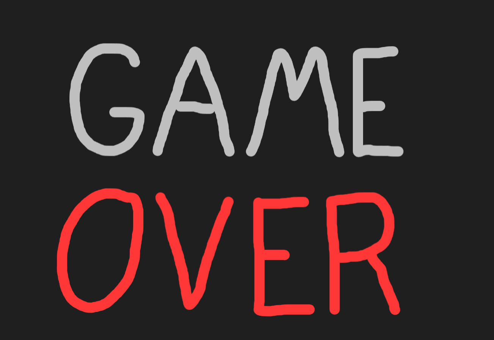

## AY26 Setris Game

### Title Screen 

### Game Screen 

### Game Over Screen

## Directions
1. Press 'enter' to start play or press the 'play' button
2. Press '?' to see the how to play screen
3. Drag the give shapes in the index to the main area to fill in the given shape.
4. Use the 'r' key to rotate pieces while dragging them.

